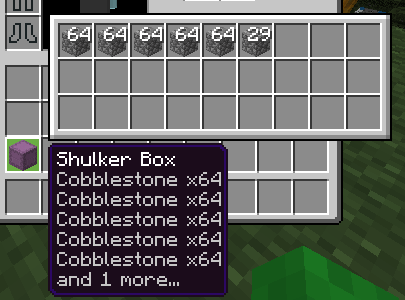
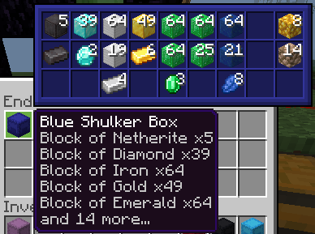
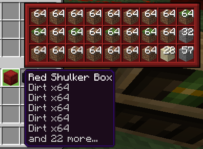
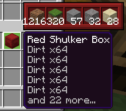

# shulker-display
An Onix Client script which allows you to see the full contents of shulker boxes without placing the box down.

## See everything
You can now see **all** the items contained in any shulker box, without having to place it down, or even take it out of your enderchest.

## A world of colour
Colour-code your boxes? The GUI can follow the colour scheme of your items.

## Just a few items
Want to know exactly how much you have of each item in total? Hold a predefined key to see the condensed view, or even switch it to the default view.

## How do I get it?
Head over to the [releases](https://github.com/CreeperG16/shulker-display/releases) page to download the latest version of the script, or get it from other sources such as the Onix Client Scripts [github repo](https://github.com/OnixClient-Scripts/OnixClient_Scripts).
- **Disclaimer**: The source code on the repository **won't work** with onix client as is!

### Building it yourself
Currently the helper program I made to organise and build my scripts is private. You can probably manually copy and paste the different files into the right places yourself though, if you were really determined not to use the download link on the latest release.
